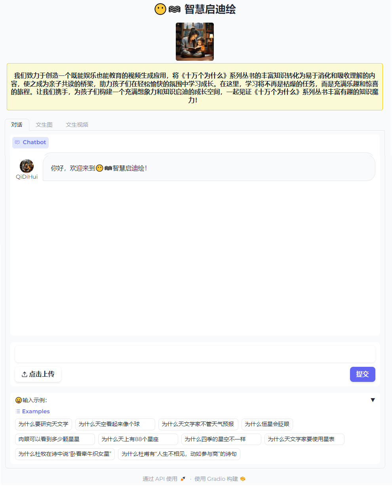

# Public QiDiHui 

<!-- PROJECT SHIELDS -->

<!-- [![Contributors][contributors-shield]][contributors-url]
[![Forks][forks-shield]][forks-url]
[![Issues][issues-shield]][issues-url]
[![MIT License][license-shield]][license-url]
[![Stargazers][stars-shield]][stars-url]
<br /> -->

## 项目概述

智慧启迪绘不仅仅是一个应用程序，它是一位能引领孩子们踏上奇妙求知之旅的伙伴，带领孩子们进入神奇知识世界的导航员，帮助父母陪伴自己孩子一起阅读《十万个为什么》系列丛书和解答阅读过程中更多疑问的知识助手。

本项目为我们公开的项目开发初期的迭代版本，包含了基本的问答功能，文生图和文生视频做了简化处理， 还请理解。

## 技术亮点

- 借由RAG技术与多模态生成技术的力量，我们倾心打造了一款既具娱乐性又富含教育意义，充满趣味性和互动性的视频生成平台，在孩子们阅读《十万个为什么》系列丛书时，进一步激发他们的好奇心，培养更好的观察能力、思考能力和表达能力，成为开启孩子智慧大门的一把钥匙。
- 两种LLM{appbuilder+ERNIEBot}接口: 充分运用百度文心一言的AIGC能力
- 两种RAG框架: Langchain & LlamaIndex
- RAG创新点: 新型向量数据库存储策略
- 多模态生成: 文本、语音和视频，也支持语音输入
- 流式输出交互UI: 在线生成，快速响应
- 预生成图片， tts和视频， 提高体验

> 以上亮点为我们项目的**完整功能**，并没有完全开源，**请为我们的项目Star以便关注最新更新**

## 主要文件功能介绍

- `requirements.txt`: 相关实验环境所需依赖包
> GPU环境只需把faiss-cpu改为faiss-gpu即可, 可以加快建库
- `web_demo.py`: Gradio Demo 
- `data_full/dataset/Astronomical_dataset.json`: 展示了示例数据， 我们只放置了10个QA数据，由于十万数据有数据隐私协议，书中包含的图片并没有开源，该数据只是展示我们的数据结构
- `faiss_index_langchain_full_ernie/bm25retriever.pkl`: 采用 BM 25 Retriever方案的数据库，这里我们只开源了使用Langchain建的库
- `rag_full/rag_langchain.py`: Langchain建库代码

## 有关宣传资料

### B站视频: 【 LIC2024 RAG赛道智慧启迪绘】"十万个所以"团队 有关介绍视频

- 【最新版本进展】https://www.bilibili.com/video/BV1yT8SejEQ8/ 
- 【产品说明】https://www.bilibili.com/video/BV1kn4y1o7VY/ 
- 【中期设计demo和进展】https://www.bilibili.com/video/BV1rb421q7xe/ 

## 启动部署方法

### 环境搭建

这里建议使用conda重新建立一个测试环境

```Bash
# 搭建环境
conda create -n QiDiHui python=3.10
conda activate QiDiHui

# 克隆本项目
git clone https://github.com/chg0901/Public_QiDiHui.git

# 安装软件库
cd Public_QiDiHui
pip install -r requirements.txt

# 启动WebDemo
python web_demo.py
```

### 部署成功后截图



### 体验链接

- 智慧启迪绘 基于文心erniebot 和千帆appbuilder 最新体验链接】
1. AIStudio   ：https://aistudio.baidu.com/application/detail/40487 
2. OpenXlab ：https://openxlab.org.cn/apps/detail/chg0901/QiDiHui_appbuilder_V2
- 【开发版本1：智慧启迪绘 基于文心erniebot 体验链接】https://openxlab.org.cn/apps/detail/chg0901/QiDiHui
- 【开发版本2：智慧启迪绘 基于千帆appbuilder 体验链接】https://openxlab.org.cn/apps/detail/chg0901/QiDiHui_appbuilder

<!-- ## Star History

[](https://star-history.com/#chg0901/Public_QiDiHui&Date) -->

## Contributors: 十万个所以团队

### 团队成员来自RAG兴趣小组，分别是

- 1. 来自韩国光云大学的 计算机工程博士生 程宏
- 2. 来自 复旦大学的 NLP准研究生 高杨帆
- 3. 来自上海海洋大学的 NLP本科毕业生 彭文博
- 4. 毕业于南京大学的 算法工程师 房宇亮
- 5. 来自昌吉学院 计算机科学与技术专业大三的 郭志航

### 团队过往开源项目 

- 1. EmoLLM [ https://github.com/SmartFlowAI/EmoLLM ] 
- 2. 食神 [https://github.com/SmartFlowAI/TheGodOfCookery] 
- 3. 峡谷小狐仙 [https://github.com/chg0901/Honor_of_Kings_Multi-modal_Dataset]
- 4. 程宏和郭志航是Datawhale鲸英助教团成员


<!-- <a href="https://github.com/chg0901/Public_QiDiHui/graphs/contributors">
  
</a> -->

[your-project-path]: chg0901/Public_QiDiHui
[contributors-shield]: https://img.shields.io/github/contributors/chg0901/Public_QiDiHui.svg?style=flat-square
[contributors-url]: https://github.com/chg0901/Public_QiDiHui/graphs/contributors
[forks-shield]: https://img.shields.io/github/forks/chg0901/Public_QiDiHui.svg?style=flat-square
[forks-url]: https://github.com/chg0901/Public_QiDiHui/network/members
[stars-shield]: https://img.shields.io/github/stars/chg0901/Public_QiDiHui.svg?style=flat-square
[stars-url]: https://github.com/chg0901/Public_QiDiHui/stargazers
[issues-shield]: https://img.shields.io/github/issues/chg0901/Public_QiDiHui.svg?style=flat-square
[issues-url]: https://img.shields.io/github/issues/chg0901/Public_QiDiHui.svg
[license-shield]: https://img.shields.io/github/license/chg0901/Public_QiDiHui.svg?style=flat-square
[license-url]: https://github.com/chg0901/Public_QiDiHui/blob/main/LICENSE
